# NestJS Backend Project

A robust backend application built with the [NestJS](https://nestjs.com/) framework, featuring PostgreSQL integration via TypeORM, real-time communication with WebSockets, and Firebase Admin services.

## 🚀 Tech Stack

* **Framework:** NestJS (v11)
* **Database:** PostgreSQL + TypeORM
* **Real-time:** Socket.io
* **Logging:** Pino (with `pino-pretty` for enhanced readability)
* **Validation:** Class-validator & Class-transformer
* **Documentation:** Swagger UI
* **Auth/Admin:** Firebase Admin SDK

  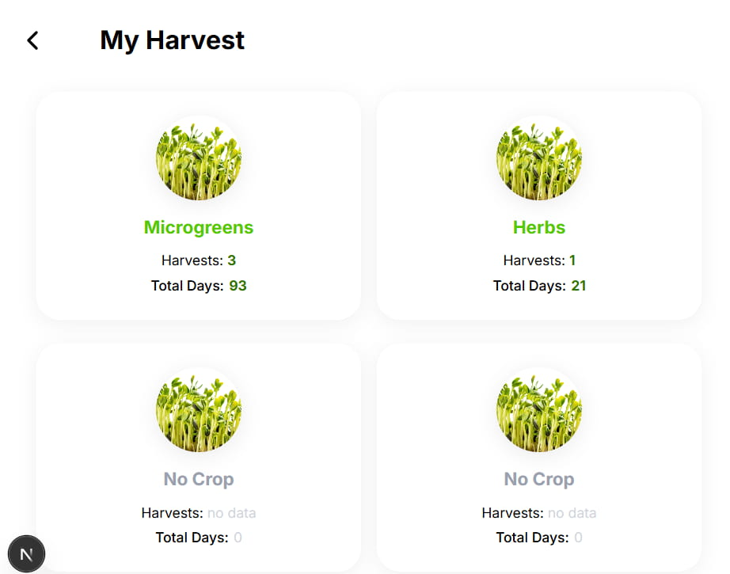
  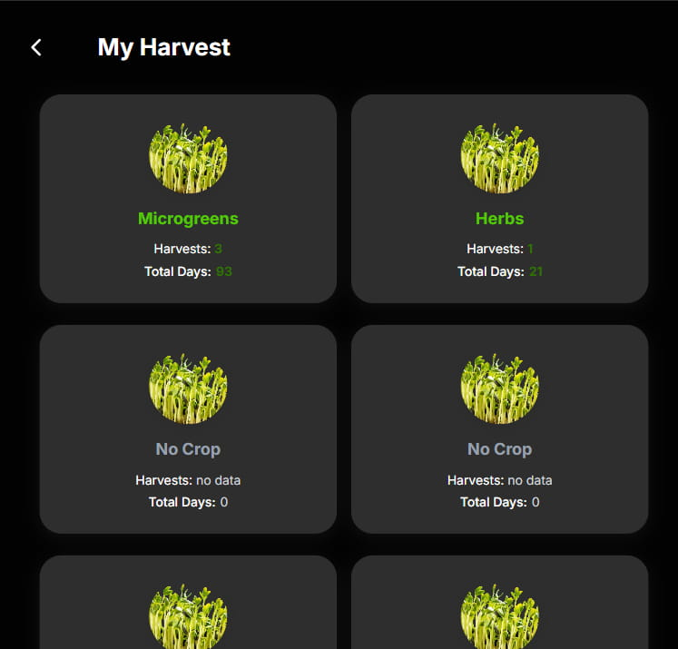
  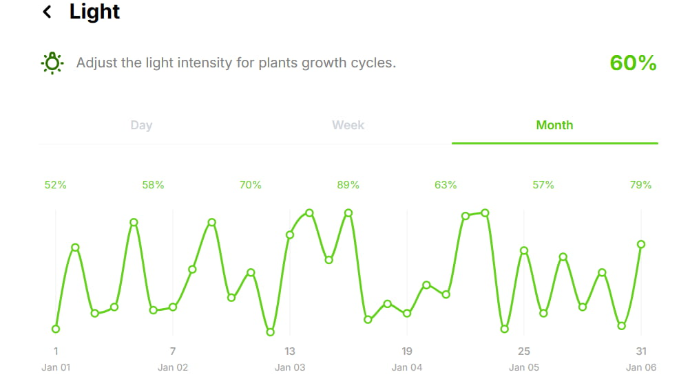
  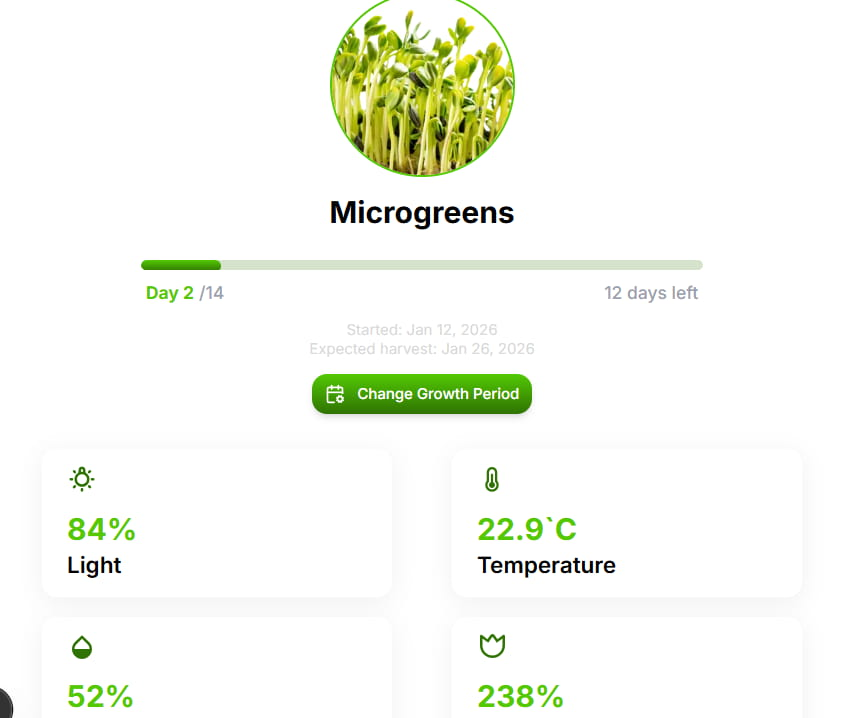
  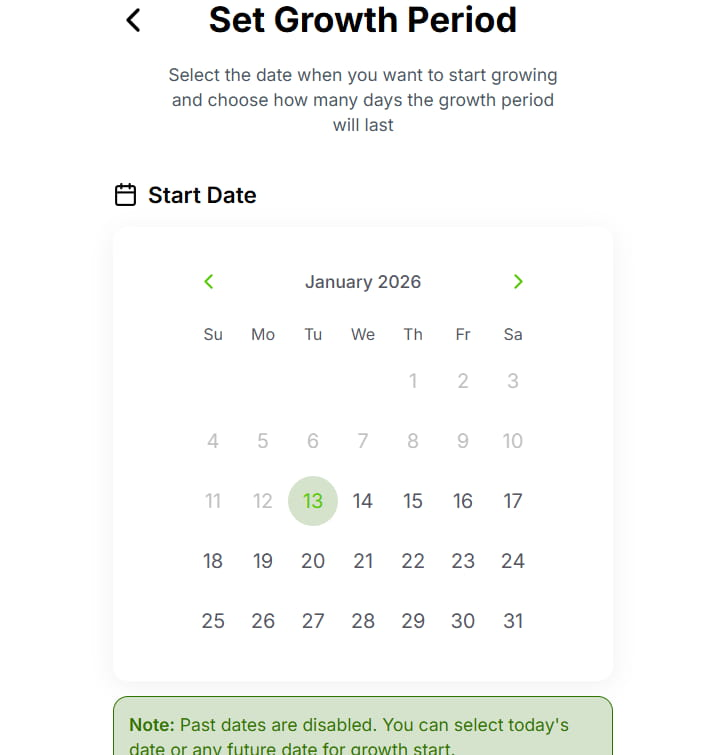
  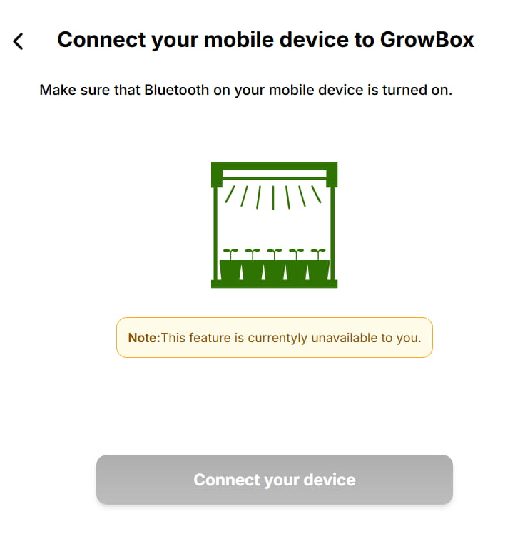
  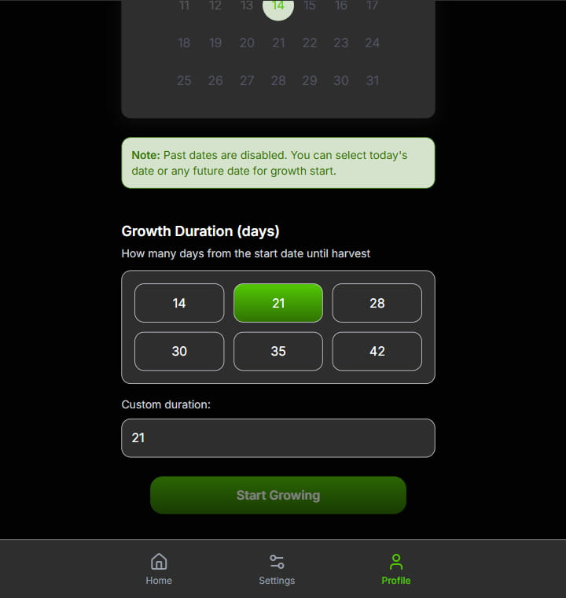
  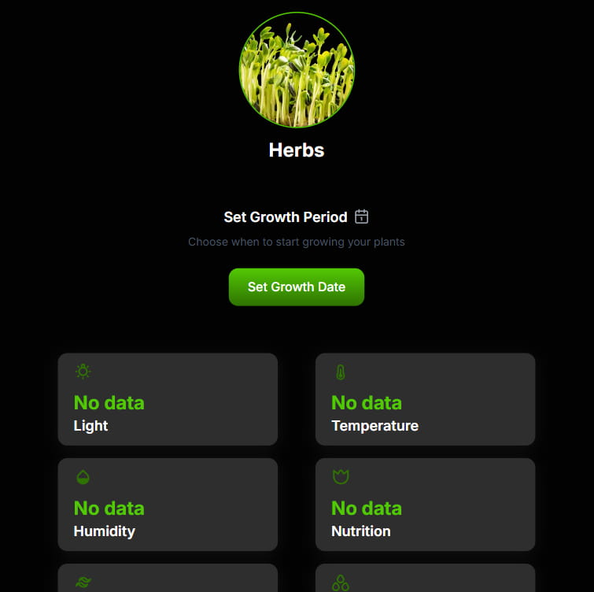
  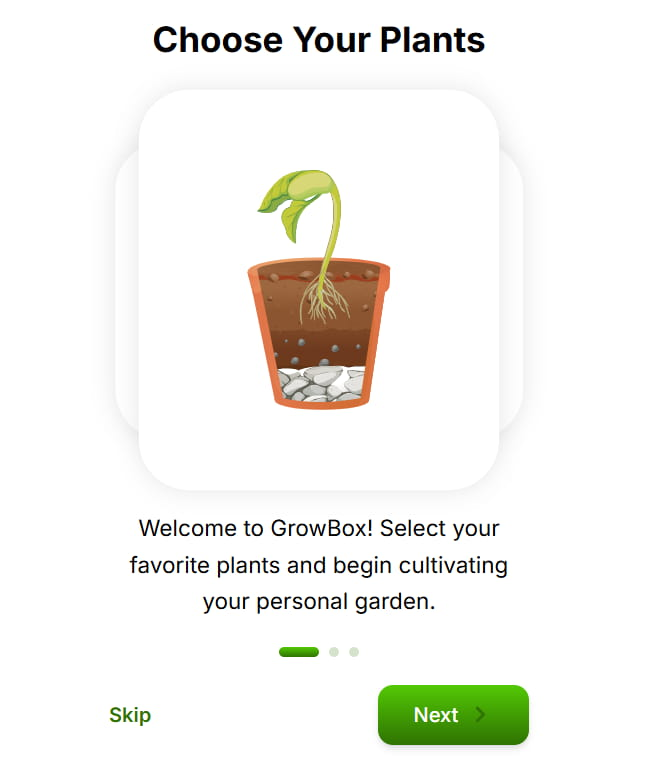
  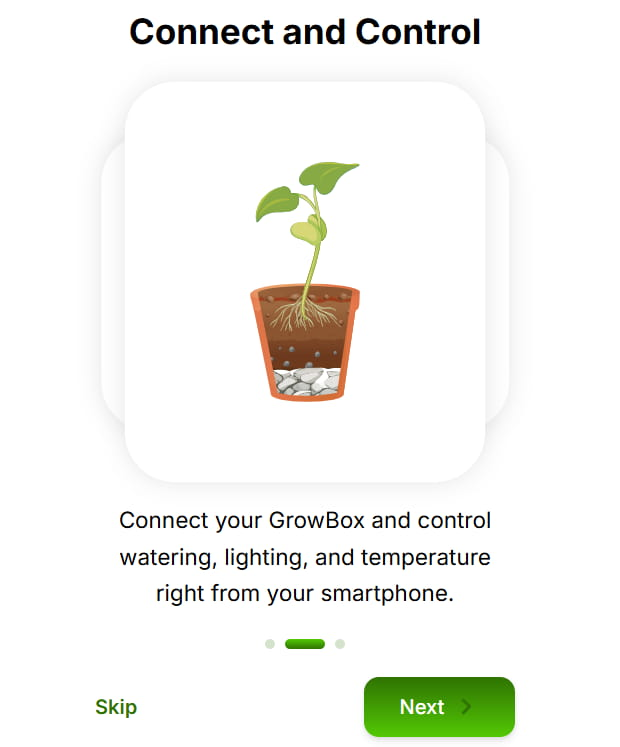
  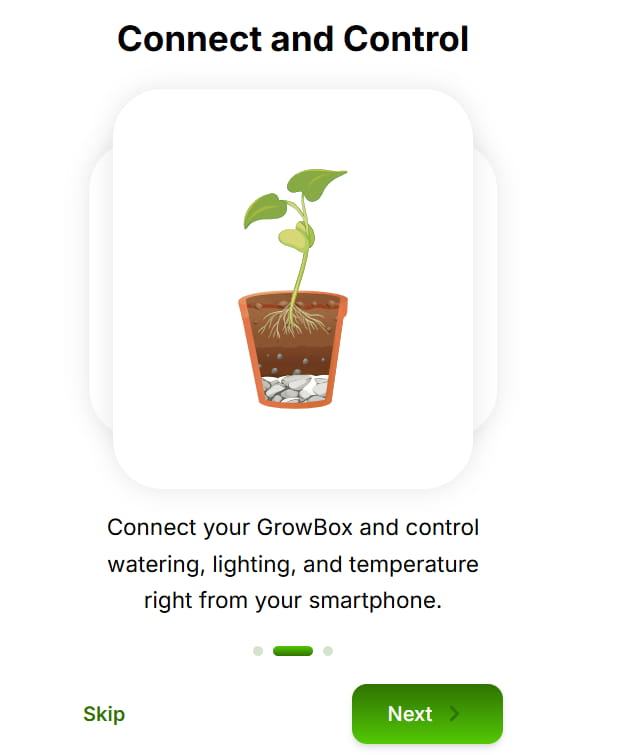
  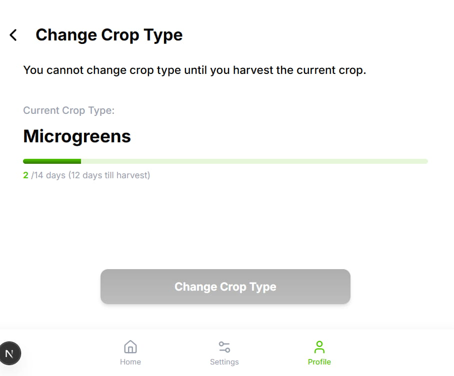
  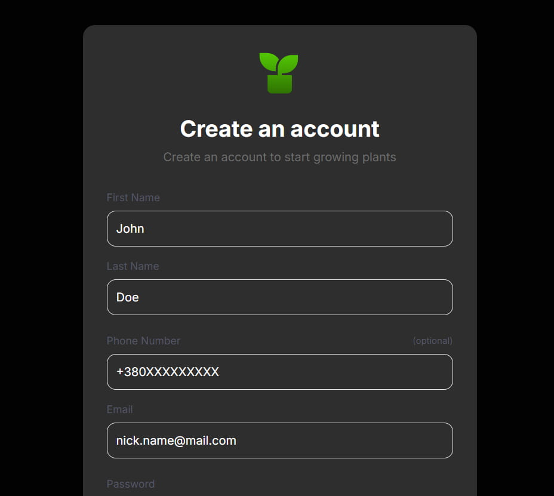
  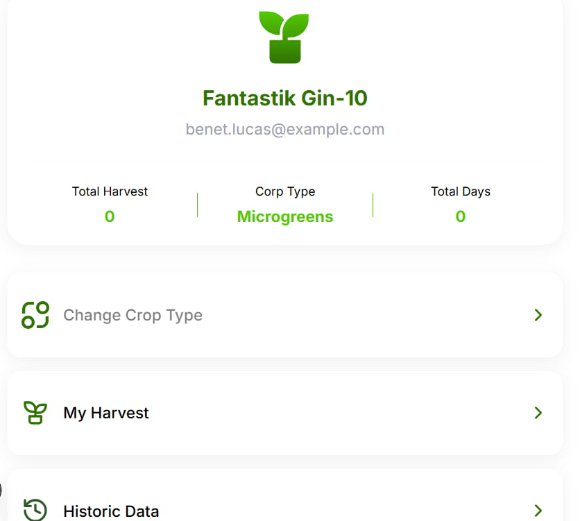
  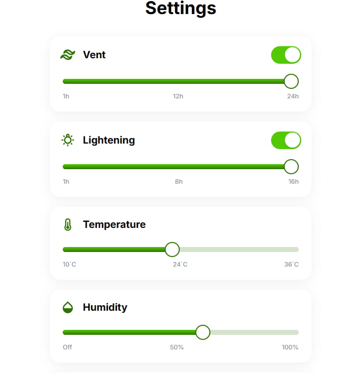
  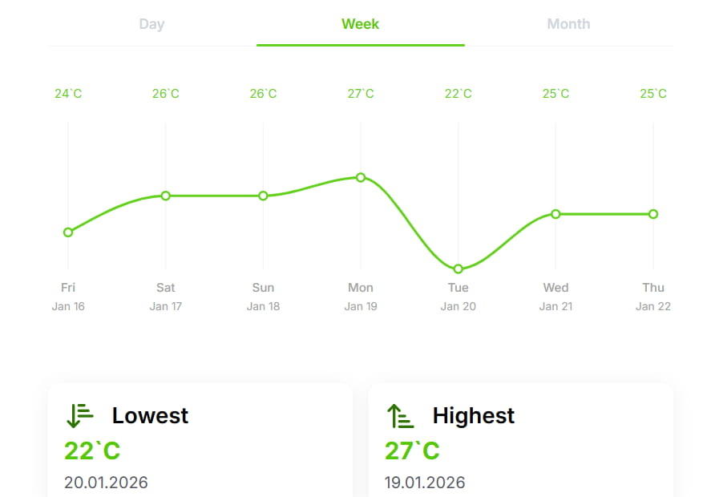
  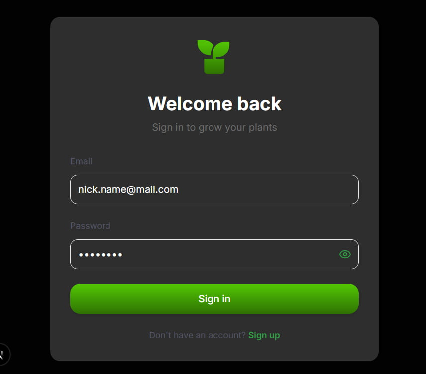
  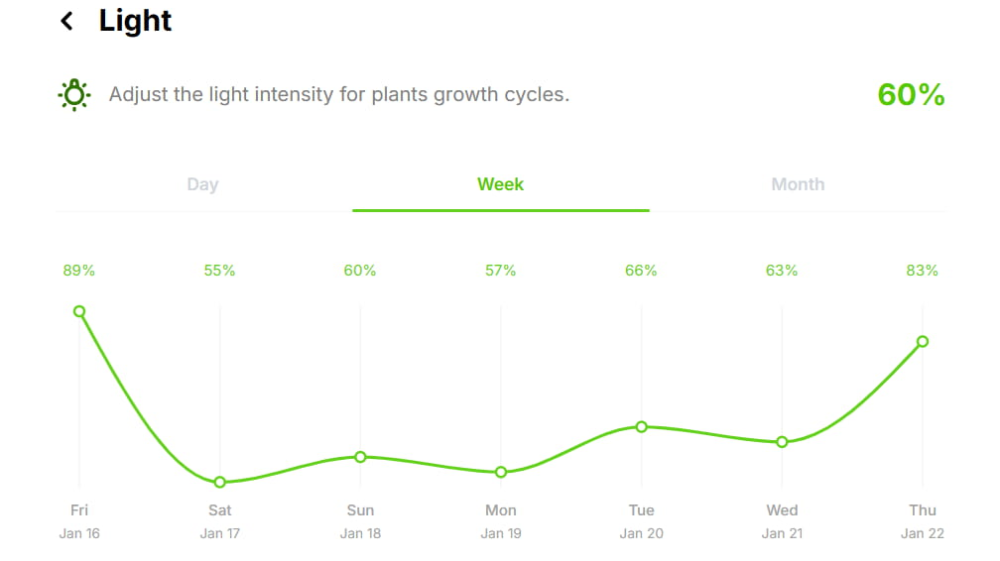
  

## 🛠 Setup & Installation

### 1. Install Dependencies
npm install

### 3. Running the Application
* **Development:** `npm run start:dev` (with hot-reload)
* **QA Mode:** `npm run start:qa`
* **Production:** `npm run start:prod`
* **Debug:** `npm run start:debug`

## 🗄 Database Management (TypeORM)
This project uses migrations to manage the database schema efficiently:

* **Generate Migration:** `npm run migration:generate` (Compares code entities with DB schema)
* **Create Migration:** `npm run migration:create` (Empty file for manual SQL/Schema changes)
* **Run Migrations:** `npm run migration:run`
* **Revert Migration:** `npm run migration:revert`

## 🧪 Testing & Quality Control
* **Unit Tests:** `npm run test`
* **E2E Tests:** `npm run test:e2e`
* **Linting:** `npm run lint` (ESLint)
* **Formatting:** `npm run format` (Prettier)

## 📖 API Documentation
Once the server is running, you can access the Swagger documentation at:
`http://localhost:4000/api-docs`

> **Note:** Check your `main.ts` file if the port or prefix differs.